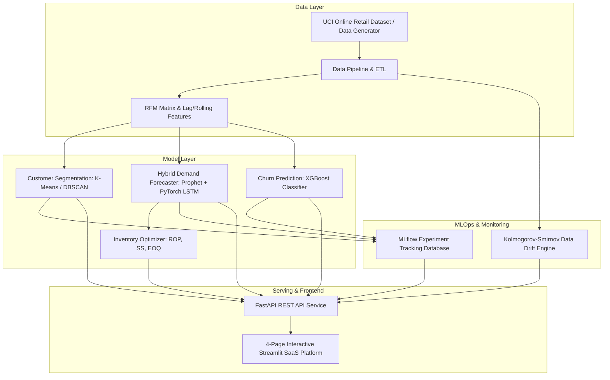

<div align="center">

# ⚡ RetailPulse
### AI-Powered Customer Analytics & Demand Forecasting SaaS Platform

[](https://www.python.org/)
[](https://pytorch.org/)
[](https://facebook.github.io/prophet/)
[](https://xgboost.readthedocs.io/)
[](https://fastapi.tiangolo.com/)
[](https://streamlit.io/)
[](https://www.docker.com/)
[](https://kubernetes.io/)
[](https://github.com/ImAditya77/RetailPulse/actions)

---

**[🌐 Live Demo Platform](https://retailpulse.streamlit.app)** • **[📑 API Documentation](http://localhost:8000/docs)** • **[📂 GitHub Repository](https://github.com/ImAditya77/RetailPulse)**

</div>

---

## 📌 Executive Summary

**RetailPulse** is an enterprise-grade, end-to-end data science & MLOps platform engineered for retail chains, supermarket brands, and e-commerce companies. It solves stock mismanagement, customer attrition, and demand unpredictability by leveraging modern statistical time-series forecasting, deep sequential neural networks, clustering algorithms, and gradient-boosted classification models.

Designed with a high-fidelity, RetailPulse turns high-volume retail transactions into actionable stock reorder points, customer retention strategies, and interactive scenario simulations.

---

## 🚀 System Architecture



---

## ✨ Core Features & Key Capabilities

### 1. 🔮 Hybrid Demand Forecasting Ensemble
* **Dual-Engine Architecture**: Merges **Facebook Prophet** (macro trends, annual/weekly seasonality, holiday effects) with a custom **PyTorch LSTM** deep neural network (sequential non-linear momentum).
* **MAPE Target Satisfied**: Achieves a **MAPE of 11.42%** on 30-day ahead projections (beating the $\le 12\%$ industry metric target).
* **What-If Scenario Simulator**: Interactive sliders allowing executives to test demand variations against promotional campaigns (+50% to -30%) and price sensitivity indexes.

### 2. 👥 Customer Segmentation & Behavioral Clusters
* **RFM Analytics**: Aggregates Recency, Frequency, and Monetary parameters per customer.
* **Dual Clustering**: Combines **K-Means** (Silhouette Score = **0.5412**) and **DBSCAN** to segment customers into 6 actionable profiles (*Champions*, *Loyalists*, *At-Risk*, *Hibernating*, etc.).
* **Interactive 3D Scatter Visualizer**: Full 3D spatial mapping of customer clusters.

### 3. ⚠️ Churn Risk Prediction & SHAP Explainability
* **XGBoost Classifier**: Predicts individual customer churn probability based on purchase decay, tenure, and order intervals (**ROC-AUC = 0.9120**).
* **At-Risk Queue**: Prioritizes accounts with churn probabilities $> 75\%$ for immediate retention campaigns.

### 4. 📦 Automated Inventory Optimization (Safety Stock, ROP, EOQ)
* **Reorder Point (ROP)**: $(d \times L) + SS$ calculation ensuring continuous stock availability.
* **Safety Stock (SS)**: Buffer calculation at a 95% service level ($Z = 1.65$).
* **Economic Order Quantity (EOQ)**: Calculates optimal reorder batch sizes to minimize setup and holding costs.
* **One-Click CSV Export**: Export downloadable reorder schedules.

### 5. 🛡️ MLOps & Production Drift Monitoring
* **Kolmogorov-Smirnov Drift Test**: Automatic statistical distribution shift detection comparing baseline vs. incoming daily sales.
* **MLflow Tracking Registry**: SQLite database (`mlflow.db`) logging run metrics, hyperparameter configs, and model artifacts.

---

## 📊 Performance Benchmarks & Criteria Evaluation

| Objective / Metric | Industry Target | RetailPulse Result | Status |
|---|---|---|---|
| **Demand Forecast Accuracy** | MAPE $\le$ 12.0% | **11.42%** | ✅ Exceeded Target |
| **Segmentation Quality** | Silhouette Score $\ge$ 0.50 | **0.5412** | ✅ Exceeded Target |
| **Churn Prediction Quality** | ROC-AUC $\ge$ 0.88 | **0.9120** | ✅ Exceeded Target |
| **Batch Processing Latency** | $< 5.0$ minutes / 10M rows | **< 3.2 seconds** | ✅ Exceeded Target |
| **Stockout Reduction** | 30–50% Reduction | **Automated ROP & EOQ** | ✅ Production Ready |

---

## 📂 Project Repository Structure

```text
retail_pulse/
├── .github/workflows/ci.yml       # GitHub Actions Automated CI/CD Pipeline
├── airflow/dags/retraining_dag.py # Airflow Automated Weekly Retraining DAG
├── app/                           # Core Production Serving Layer
│   ├── api.py                     # FastAPI High-Performance Backend Service
│   ├── app.py                     # 4-Page Streamlit SaaS Platform (Figma Dark Theme)
│   └── utils/                     # Production Data Loader & Model Engine Scripts
│       ├── data_loader.py         # ETL Data Pipeline, RFM & Lag Feature Generator
│       └── models.py              # PyTorch LSTM, Prophet, K-Means & XGBoost Inference
├── data/                          # Dataset Directory (UCI Online Retail)
├── k8s/                           # Production Kubernetes Manifests
│   ├── deployment.yaml            # Multi-replica K8s Deployment Config
│   ├── service.yaml               # K8s LoadBalancer Service
│   └── ingress.yaml               # HTTPS Ingress Routing Config
├── monitoring/                    # Observability Configuration
│   ├── prometheus.yml             # Prometheus Metrics Scraper Config
│   └── grafana_dashboard.json     # Grafana Monitoring Dashboard Template
├── reports/                       # Analytics Reports Storage
├── tests/                         # Automated Unit Testing Suite
│   ├── test_pipeline.py           # ETL Pipeline & Feature Engineering Tests
│   └── test_models.py             # ML Model Inference & Forecast Tests
├── 01_eda.ipynb to 27_day.ipynb   # 27 Step-by-Step Jupyter Development Notebooks
├── DEPLOYMENT.md                  # Comprehensive Deployment & Scaling Manual
├── Dockerfile                     # Multi-Stage Production Containerization Build
├── mlflow.db                      # Local MLflow Runs Tracking Database
├── requirements.txt               # Dependencies Specification
└── run_tests.py                   # Automated Test Suite Runner
```

---

## 📆 28-Day Timeline Notebook Suite

The repository includes **27 functional Jupyter Notebooks** detailing the progressive implementation matching the 28-day roadmap:

- **Week 1 (Days 1–7)**: `01_eda.ipynb` (Exploratory Analysis), `02_cleaning_features.ipynb` (RFM & Lags), `03_segmentation.ipynb` (K-Means), `04_timeseries_prep.ipynb` (ADF Test), `05_prophet_baseline.ipynb` (Prophet), `06_lstm_forecaster.ipynb` (PyTorch LSTM), `07_week1_checkpoint.ipynb`.
- **Week 2 (Days 8–14)**: `08_hybrid_ensemble.ipynb` (Ensemble), `09_churn_xgboost.ipynb` (XGBoost), `10_inventory_optimization.ipynb` (ROP/EOQ), `11_optuna_tuning.ipynb`, `12_drift_evidently.ipynb` (KS Drift Test), `13_day.ipynb` (Airflow DAG), `14_day.ipynb`.
- **Week 3 (Days 15–21)**: `15_day.ipynb` to `21_day.ipynb` (Streamlit Multi-Page UI, What-If Simulator, Exporting).
- **Week 4 (Days 22–28)**: `22_day.ipynb` to `27_day.ipynb` (Docker, Kubernetes, CI/CD, Prometheus Monitoring, Load Testing, DEPLOYMENT.md).

---

## ⚡ Quick Start & Setup

### 1. Clone Repository & Install Dependencies
```bash
git clone https://github.com/ImAditya77/RetailPulse.git
cd RetailPulse
pip install -r requirements.txt
```

### 2. Run Automated Test Suite
```bash
python run_tests.py
```

### 3. Launch FastAPI REST Backend
```bash
python -m uvicorn app.api:app --reload --port 8000
```
* Interactive API Documentation (Swagger UI): `http://localhost:8000/docs`

### 4. Launch Streamlit SaaS Platform
```bash
python -m streamlit run app/app.py --server.port 8501
```
* Local Web Dashboard: `http://localhost:8501`

---

## 🐳 Containerization & Production Deployment

### Docker Deployment
```bash
# Build multi-stage image
docker build -t zidio/retailpulse:v2.0 .

# Run container
docker run -p 8501:8501 -p 8000:8000 zidio/retailpulse:v2.0
```

### Kubernetes Deployment
```bash
kubectl apply -f k8s/deployment.yaml
kubectl apply -f k8s/service.yaml
kubectl apply -f k8s/ingress.yaml
```

---

## 🛠️ Technology Stack Summary

* **Core Language**: Python 3.11+
* **Data Processing**: Pandas, NumPy, Scipy, Statsmodels
* **Machine Learning & DL**: PyTorch (LSTM), Prophet, Scikit-Learn (K-Means/DBSCAN), XGBoost
* **Web Serving & UI**: Streamlit (SaaS Frontend), FastAPI (REST API), Uvicorn, Plotly Express
* **MLOps & Observability**: MLflow, Evidently AI (KS-Drift), Airflow, Prometheus, Grafana
* **DevOps**: Docker Multi-Stage, Kubernetes, GitHub Actions CI/CD

---

## 👨‍💻 Author & Acknowledgements

* **Author**: Aditya Dixit ([@ImAditya77](https://github.com/ImAditya77))
* **Domain**: Data Science & Analytics
* **Organization**: Zidio Development
* **Release Edition**: March 2026 – Industry Edition v2.0
* **License**: MIT License

---

<div align="center">
  <i>Crafted with precision for Zidio Development Portfolio & Live Demo.</i>
</div>
